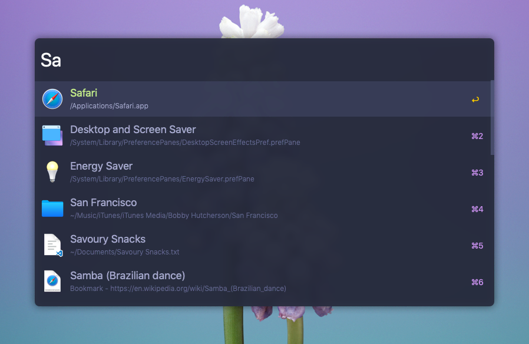

# Notice: I've now created a new repo with all of the material theme variants and 2 styles to choose from. Check it out at https://github.com/r3volution11/material-theme-alfred.

# Material Palenight Theme for Alfred (macOS)

Based on the most epic theme for Visual Studio Code made by @equinusocio, [Material Theme](https://github.com/material-theme/vsc-material-theme).

## Install

1. Clone or Download this repository. 
2. Navigate to directory and open `Material Palenight.alfredappearance`. 
3. Alfred will take it from there!

## What's Alfred?

**You're joking, right?** 

It's only one of the best productivity apps ever made for macOS. 

Do yourself a favor and [**check it out!**](https://www.alfredapp.com/)
